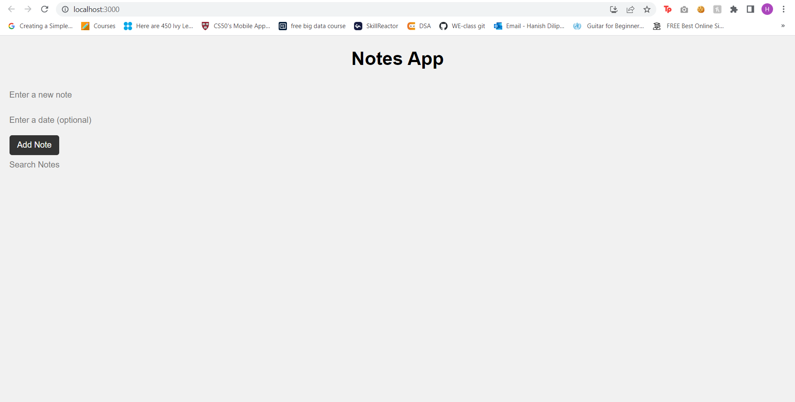
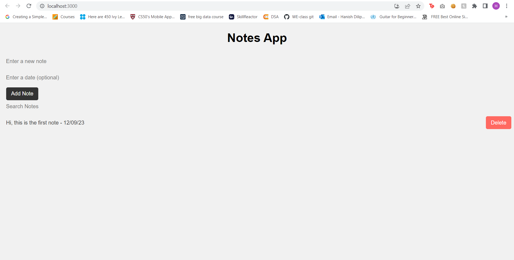
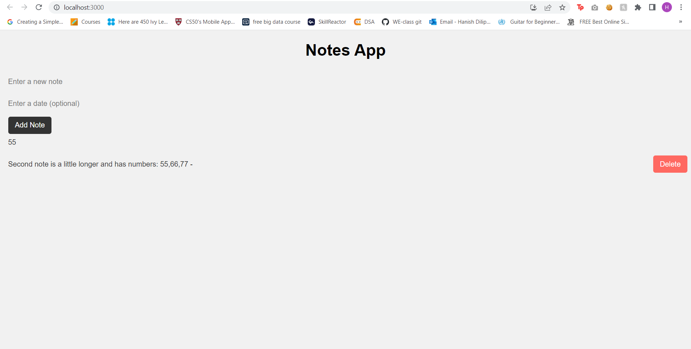

### Description
- This is a simple notes app built with React. It allows you to create, read, update, and delete notes. It also includes the ability to search notes by title or content, add dates to notes, and toggle between light and dark mode.

### Installation
- Clone the repository to your local machine.
- Install the required dependencies by running the following command in the project directory:

- npm install

### Start the app by running the following command:

- npm start

- Open your web browser and navigate to http://localhost:3000 to view the app.

###  Usage
- To create a new note, click the "New Note" button and enter a title and content for the note. You can also add a date to the note by clicking the calendar icon.

- To edit a note, click the note's title or content to enter edit mode. Make your changes and click the "Save" button to save the changes, or click the "Cancel" button to discard the changes.

- To delete a note, click the trash can icon next to the note.

- To search for notes, enter a search term in the search bar. Notes that contain the search term in the title or content will be displayed.

### Credits
- This app was built with React and styled with CSS. It also uses the date-fns library for date formatting.

### ScreenShots

